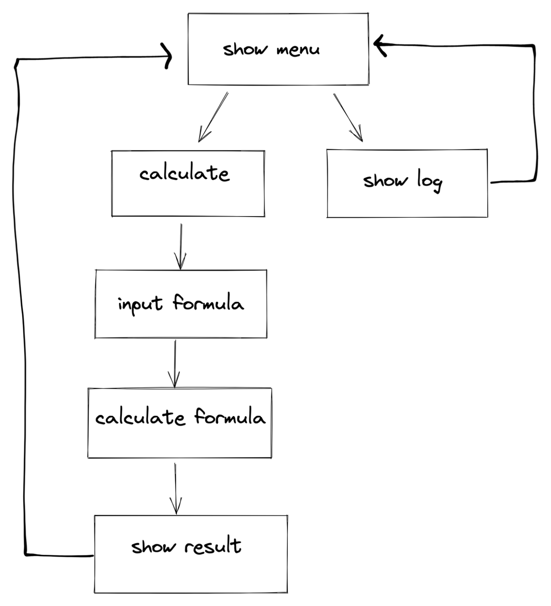
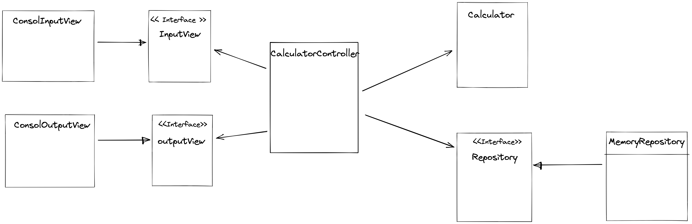

# java_calculator
자바 계산기 구현 미션 Repository입니다.

## 미션의 목표

- 깃허브를 통한 코드리뷰를 경험해보자
- 기본적인 테스트 코드 작성 및 활용하는 능력해보자
- 스스로 OOP를 생각하고 코드로 옮길 수 있는 능력해보자

## 미션 환경
**언어**
- Java

**빌드 도구**
- gradle

**테스트 도구**
- JUnit5, assertj

## 미션 소개

### 요구사항
- 객체지향적인 코드로 계산기 구현하기
    - [X]  더하기
    - [X]  빼기
    - [X]  곱하기
    - [X]  나누기
    - [X]  우선순위(사칙연산)
- [X]  테스트 코드 구현하기
- [X]  계산 이력을 맵으로 데이터 저장기능 만들기(인메모리 DB)
- [X] 정규식 사용

### 실행결과(콘솔)
```
1. 조회
2. 계산

선택 : 2

1 + 2
3

1. 조회
2. 계산

선택 : 2

1 + 2 * 3
7

1. 조회
2. 계산

선택 : 1

1 + 2 = 3
1 + 2 * 3 = 7

선택 : 2

3 - 2 * 2
-1
```

### 설계도

- Flow Chart


<br/>

- Class Diagram


<br/>

### commit convention

- [AngularJS commit conventions](https://gist.github.com/stephenparish/9941e89d80e2bc58a153#format-of-the-commit-message)

### java convention

- [google convention](https://google.github.io/styleguide/javaguide.html)

## 받은 피드백

### 1차 피드백
- [X] .gitignore도 깔끔하게 관리하기
- [X] 사칙연산 enum을 이용한 전략패턴으로 구현해보기
- [X] matches는 비싼 행위 대안 생각해보기
- [X] 한 메서드에 Depth가 많으면 리펙토링 요소. depth가 많으면 분리해보기
- [X] menu도 enum으로 관리해보기
- [X] 과연 scanner를 컨트롤러에서 넣어주는게 맞는걸까?
- [X] System.lineSeparator() 알아보기
- [X] 클래스명이 Log인 것은 좋지 않다.
- [X] stream은 한줄에 하나씩 쓰는게 좋다.
- [X] 데이터베이스에 getter가 필요한가?
- [X] 차후 select가 생기면 어떻게 찾을 수 있을까?
- [X] 단순히 콘솔 프로그램인데 서비스가 필요하다고 생각이 드는가?
- [X] test에 Mockito를 사용한 이유.

### 2차 피드백
- [X] build.gradle 관리
  - java version 관리
  - 사용하지 않는 라이브러리 제거
- [X] 람다 활용하기
- [X] 함수형 인터페이스 활용하기
- [X] Service 없애기
- [X] Error 출력을 outputView에서 출력
- [X] 정적 메서드를 사용한 이유?
- [X] 불변 및 멀티스레드에 생각
- [X] 문자열 상수로 바꾸기
- [X] 모든 메서드 1depth로 리팩토링